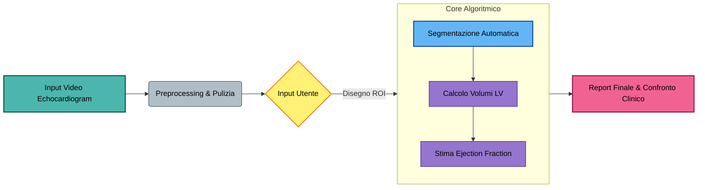
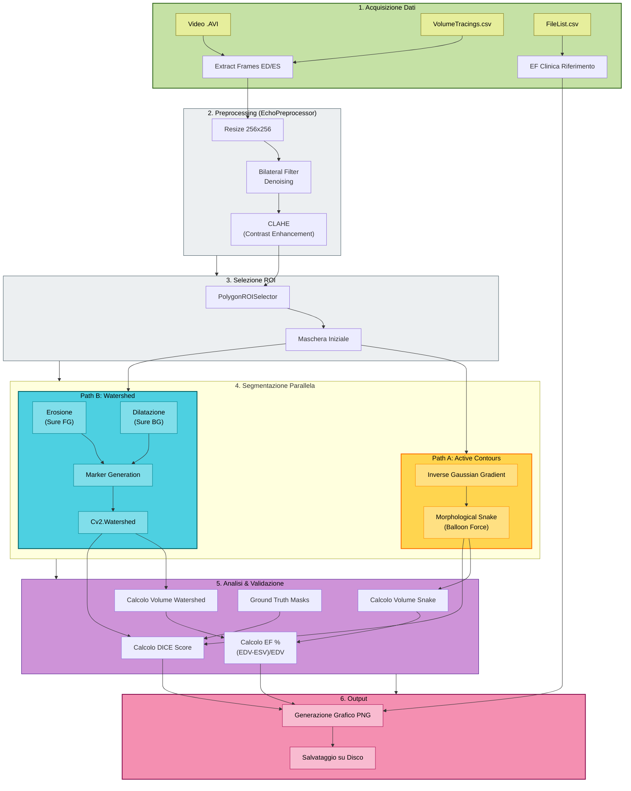

# Panoramica Architetturale di CardioEF

## Diagramma di Flusso ad Alto Livello

Descrizione per la presentazione:

1. **Input**: Il sistema prende in ingresso il video ecocardiografico grezzo.
2. **Preprocessing**: Le immagini vengono pulite dal rumore.
3. **Input Utente**: Il medico o l'operatore seleziona approssimativamente l'area del cuore.
4. **Core**: Il sistema traccia i contorni precisi, calcola i volumi (Diastole/Sistole) e la percentuale di Eiezione (EF).
5. **Output**: Viene generato un report che confronta i dati calcolati con quelli dell'ospedale.

## Diagramma di Flusso Dettagliato del Processo

1. **Acquisizione**: Incrociamo il video `.avi` con il CSV dei tracciati per estrarre solo i due frame critici: **End-Diastole (ED)** e **End-Systole (ES)**. Recuperiamo anche l'EF di riferimento da `FileList.csv`.
2. **Preprocessing (EchoPreprocessor)**:
    - Ridimensioniamo a 256x256 per standardizzare l'input.
    - Applichiamo il **Bilateral Filter** per togliere lo speckle noise mantenendo i bordi.
    - Applichiamo **CLAHE** per risaltare le pareti del ventricolo.
3. **Selezione ROI**: L'utente disegna un poligono. Da questo generiamo una maschera binaria di partenza.
4. **Segmentazione**:
    - **Snake (Active Contours)**: Calcola il gradiente inverso e fa evolvere la curva usando forze elastiche (smoothing) e forze di "palloncino" (balloon).
    - **Watershed**: Usa la ROI per creare marker sicuri (interno/esterno) e lascia all'algoritmo il compito di trovare il confine esatto nella "zona incerta".
5. **Analisi**:
    - **Geometrica**: Calcoliamo il **DICE Score** confrontando le nostre maschere con il Ground Truth (tracciati manuali nel CSV).
    - **Clinica**: Stimiamo il volume (Metodo Area-Length) e calcoliamo la **Frazione di Eiezione**.
6. **Output**: Generiamo un'immagine composita con i contorni visivi, i valori numerici e il confronto diretto con i dati di Stanford.

