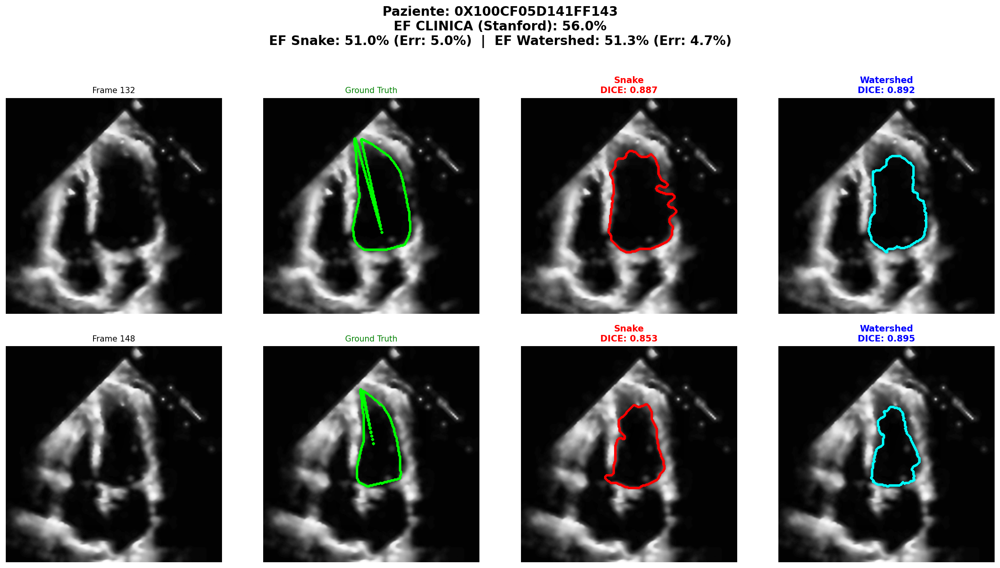
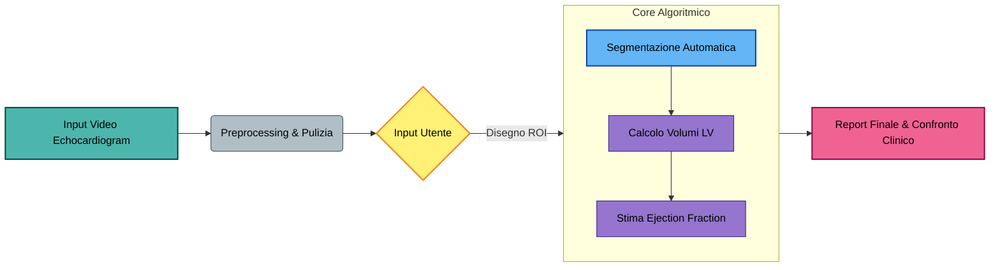
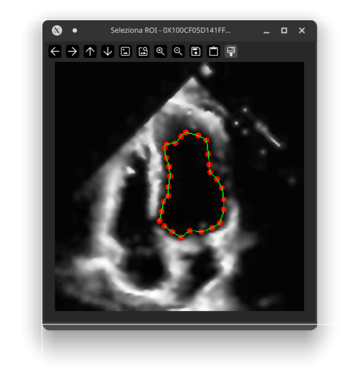
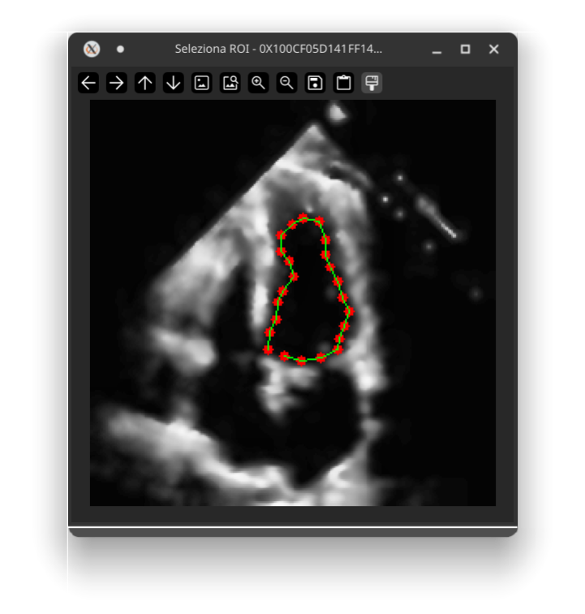
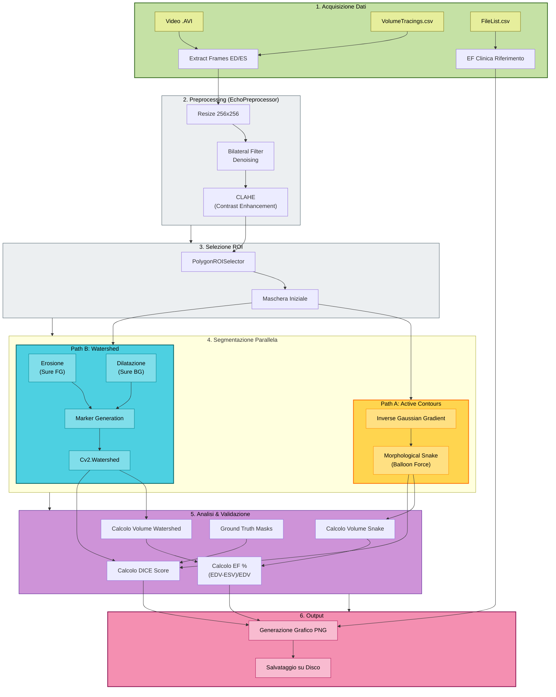

# CardioEF: Automated Left Ventricle Segmentation & Ejection Fraction Estimation

**CardioEF** è una pipeline di Computer Vision classica progettata per l'analisi automatica di ecocardiografie (Apical-4-Chamber view). Il progetto confronta due approcci di segmentazione semi-automatica (**Active Contours** vs **Marker-Controlled Watershed**) per isolare il ventricolo sinistro, calcolare i volumi cardiaci e stimare la Frazione di Eiezione (EF), un parametro vitale per la diagnosi di insufficienza cardiaca.

Il sistema è stato sviluppato e validato sul dataset open-source **EchoNet-Dynamic** (Stanford Medicine) e testato su acquisizioni reali di ultima generazione.



---

## 🏥 Contesto Clinico

L'ecocardiografia è la modalità di imaging più comune per valutare la funzionalità cardiaca. Il parametro chiave estratto è la **Frazione di Eiezione (EF)**, che indica la percentuale di sangue pompata fuori dal ventricolo a ogni battito.

$$EF ( \% ) = \frac{EDV - ESV}{EDV} \times 100$$

Dove:
* **EDV (End-Diastolic Volume):** Volume massimo (cuore rilassato/pieno).
* **ESV (End-Systolic Volume):** Volume minimo (cuore contratto).

Un'accurata segmentazione del ventricolo sinistro è fondamentale per calcolare questi volumi. CardioEF automatizza questo processo riducendo la variabilità soggettiva e confrontando i risultati con i tracciati manuali di cardiologi esperti.

---

## ⚙️ Architettura Tecnica
Il sistema segue una pipeline sequenziale divisa in 6 fasi logiche, come illustrato nel diagramma seguente:


### 1. Acquisizione Dati e Frame
Il software incrocia i video grezzi (`.avi`) con il file di annotazioni `VolumeTracings.csv`. Vengono estratti automaticamente solo i frame chiave corrispondenti a:
* **ED (End-Diastole):** Momento di massima espansione.
* **ES (End-Systole):** Momento di massima contrazione.

### 2. Preprocessing (`EchoPreprocessor`)
Per mitigare lo *speckle noise* (rumore granulare tipico degli ultrasuoni) senza perdere dettagli anatomici, applichiamo una catena di filtri:
1. **Ridimensionamento:** Standardizzazione input a 256x256 pixel.
2. **Bilateral Filter:** Rimuove il rumore nelle aree omogenee preservando i bordi netti (edge-preserving smoothing).
3. **CLAHE (Contrast Limited Adaptive Histogram Equalization):** Esalta il contrasto locale per evidenziare le pareti del ventricolo.

### 3. Selezione ROI (`PolygonROISelector`)
Poiché l'ecocardiografia contiene molte strutture in movimento, l'utente definisce una **Regione di Interesse (ROI)** poligonale iniziale. Questa maschera serve da:
* Inizializzazione per il metodo Snake.
* Generatore di marker (Sfondo sicuro / Oggetto sicuro) per il metodo Watershed.

| Selezione ROI EDV                        | Selezione ROI ESV                          |
|------------------------------------------|--------------------------------------------|
|  |  |

### 4. Algoritmi di Segmentazione (Confronto)
Il cuore del progetto confronta due approcci matematici distinti:
* **Metodo A: Geodesic Active Contours (Snakes)**
  * *Tecnica:* Utilizza curve evolutive che minimizzano un'energia basata sul gradiente inverso dell'immagine. Include una forza "Balloon" per spingere i contorni verso i bordi.
  * *Pro:* Modella forme curve naturali e lisce.
  * *Contro:* Sensibile ai minimi locali (può bloccarsi su falsi bordi).


* **Metodo B: Marker-Controlled Watershed**
  * *Tecnica:* Approccio morfologico basato sull'immersione. Utilizza la ROI erosa come "marker interno" e la ROI dilatata come "marker esterno".
  * *Pro:* Deterministico e molto robusto al rumore speckle. Evita il "leakage" (fuoriuscita del contorno) grazie ai marker.

### 5. Analisi Volumetrica e Clinica
Una volta ottenute le maschere binarie:
* **Volumi (ml):** Calcolati con il **Metodo Area-Length (Single Plane)**, assumendo il ventricolo come un ellissoide di rotazione.
* **Ejection Fraction (EF):** Derivata dalla formula standard .
* **Validazione:** Calcolo del **DICE Score** (sovrapposizione geometrica) rispetto al Ground Truth dei cardiologi.

### 6. Output
Viene generato un report grafico `.png` che visualizza fianco a fianco i risultati dei due algoritmi, evidenziando il DICE Score e l'errore percentuale sull'EF rispetto ai dati clinici reali.


### Diagramma di Flusso Dettagliato


## 📊 Validazione e Risultati

Il sistema confronta i risultati ottenuti con il **Ground Truth** (tracciati manuali) fornito dal dataset EchoNet-Dynamic.

Le metriche di valutazione includono:
1.  **DICE Coefficient (Geometrico):** Misura la sovrapposizione tra la maschera generata e quella del medico ($0.0 - 1.0$).
2.  **Delta EF (Clinico):** Differenza assoluta tra l'EF calcolata dall'algoritmo e l'EF clinica riportata nel dataset.

*Esempio di Output:*
> - **Watershed:** DICE Score ~0.80 (Alta affidabilità geometrica)
> - **Clinica:** Errore medio EF < 5% (Accettabile per screening)
---

## 🚀 Installazione e Utilizzo

### Prerequisiti
* Python 3.8+
* Dataset EchoNet-Dynamic (scaricato localmente)

### 1. Clona il repository
```bash
git clone https://github.com/pietro2356/CardioEF.git
cd CardioEF
```

### 2. Installa le dipendenze
Tutte le librerie necessarie sono elencate in requirements.txt.
```bash
pip install -r requirements.txt
```

### 3. Configurazione
Copiate il file [.env.example](.env.example) e rinominatelo in `.env`.
All'interno modificate la variabile `DATASET_BASE_PATH` impostando come valore il percorso della cartella del dataset EchoNet-Dynamic.
> La variabile `REPORT_BASE_PATH` contiene il percorso dove salvare i report.
```dotenv
DATASET_BASE_PATH='C:/Percorso/Al/Dataset/EchoNet-Dynamic'
REPORT_BASE_PATH='./reports'
```

### 4. Esecuzione
Lancia la pipeline principale. Verrà analizzato un paziente di test (o una lista).
```bash
python main.py
```
Durante l'esecuzione:
- Verrà mostrato il frame (ED o ES).
- Disegna un poligono attorno al ventricolo col mouse (Click sx per i punti, Click dx per chiudere).
- Il sistema calcolerà le maschere e mostrerà il report comparativo.

## 📂 Struttura del Progetto
- [main.py](main.py): Script principale (Orchestrazione, Calcolo EF, Report).
- [roi_selector.py](roi_selector.py): Gestione dell'interfaccia utente per la selezione ROI.
- [segmentation_geodesic.py](segmentation_geodesic.py): Implementazione Active Contours (Snake).
- [segmentation_watershed.py](segmentation_watershed.py): Implementazione Marker-Controlled Watershed.
- [ground_truth_generator.py](ground_truth_generator.py): Parsing dei file CSV e generazione maschere di riferimento.
- [utils_video.py](utils_video.py): Estrazione frame da video AVI.

## 📝 Autori
Sviluppato per il corso di Tecnologie Multimediali.
- Pietro Rocchio
- Juri Marku